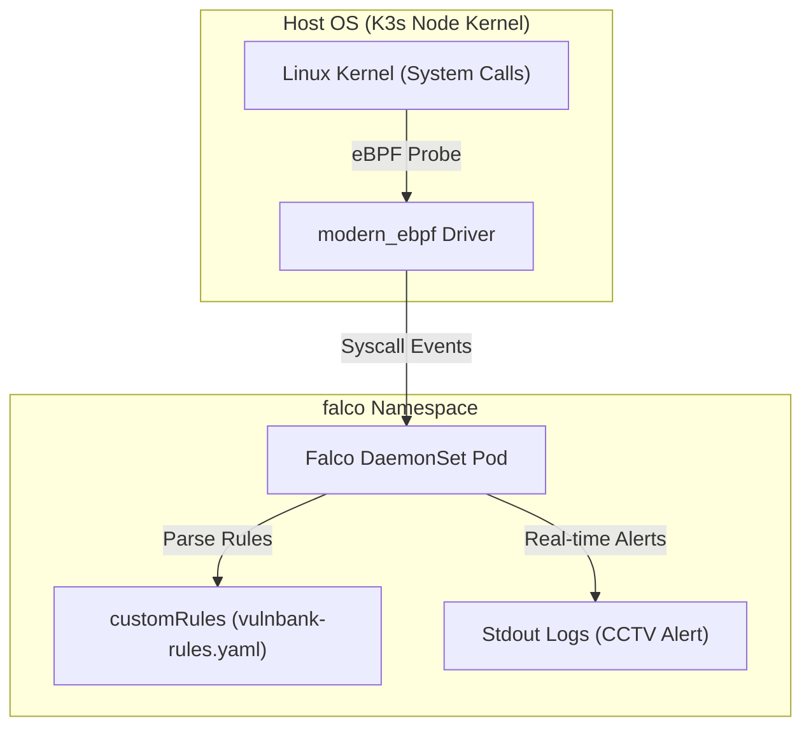

# 🦅 Falco Runtime Security Agent for SecuBank

이 디렉토리는 SecuBank DevSecOps 골든 패스 환경 내에서 컨테이너 내부의 비정상적인 행위를 커널 수준에서 실시간 감시하는 **Falco 런타임 침입 탐지 엔진**의 설정과 룰셋을 관리합니다.

---

## 1. 아키텍처 개요



Falco는 컨테이너에 어떠한 에이전트 코드도 직접 삽입하지 않습니다. 대신 호스트 운영체제 커널 수준에서 실행되는 **modern eBPF 드라이버**를 통해 컨테이너 내부에서 커널을 통과하는 모든 시스템 콜(syscall)을 고속 수집 및 분석합니다.

---

## 2. 수록된 2대 특화 탐지 룰

`values.yaml` 내부에 정의된 두 가지 핵심 커스텀 룰은 침투 공격의 핵심 킬 체인을 타깃팅합니다.

| 룰 이름 | 위험도 | 탐지 대상 및 조건 |
| :--- | :--- | :--- |
| **`Shell spawned in VulnBank container`** | **WARNING** | `vulnbank` 컨테이너 내에서 `bash`/`sh`/`ash` 등 대화형 쉘이 무단으로 실행되는 프로세스 수립 단계 포착 |
| **`VulnBank PHP file upload detected`** | **CRITICAL** | `vulnbank` 컨테이너의 웹 디렉토리(`/var/www/html` 등) 내부에 악성 쉘 업로드(Webshell) 목적의 `.php` 확장자 파일 쓰기/생성 동작 포착 |

---

## 3. 실시간 침입 탐지 검증 가이드 (PoC)

Falco 에이전트가 완벽하게 배포된 후, 아래 시나리오를 통해 위협 탐지 능력을 직접 입증해 볼 수 있습니다.

### 0) 실시간 Falco 경보 로그 스트리밍 활성화
가장 먼저, 별도의 터미널 창을 열고 Falco Pod의 경보 출력을 실시간으로 모니터링합니다.
```bash
kubectl logs -n falco -l app.kubernetes.io/name=falco -f | grep -E "Shell spawned|PHP file"
```

---

### Scenario A. 대화형 쉘 무단 획득 공격 재현
해커가 웹 서버의 원격 코드 실행(RCE) 취약점을 이용해 컨테이너 내부 터미널 쉘에 침투하는 과정을 재현합니다.

1. **침투 명령어 실행** (VulnBank Frontend Pod에 강제로 bash/sh 진입 시도):
   ```bash
   kubectl exec -it $(kubectl get pods -n secure-path-dev -l app=vulnbank-frontend -o jsonpath='{.items[0].metadata.name}') -n secure-path-dev -- /bin/sh
   ```

2. **Falco 경보 확인**:
   모니터링 중인 로그 터미널에 아래와 같은 WARNING 보안 비상 경보가 실시간 발행되는지 확인합니다:
   ```text
   WARNING Shell spawned in VulnBank container (user=root user_uuid=0 parent=kubectl cmdline=/bin/sh image=securious/vulnbank-frontend:latest container_id=...)
   ```

---

### Scenario B. 악성 웹셸(Webshell) 업로드 및 파일 쓰기 공격 재현
해커가 파일 업로드 메뉴를 우회하여 서버 내부에 악성 백도어 웹셸 파일(`webshell.php`)을 생성하는 과정을 재현합니다.

1. **악성 PHP 파일 업로드/쓰기 명령어 실행**:
   ```bash
   kubectl exec -it $(kubectl get pods -n secure-path-dev -l app=vulnbank-frontend -o jsonpath='{.items[0].metadata.name}') -n secure-path-dev -- touch /var/www/html/webshell.php
   ```

2. **Falco 경보 확인**:
   모니터링 중인 로그 터미널에 아래와 같은 CRITICAL 침입 경보가 실시간 발행되는지 확인합니다:
   ```text
   CRITICAL PHP file upload/write detected in VulnBank web root (file=/var/www/html/webshell.php user=root user_uuid=0 proc=touch cmdline=touch /var/www/html/webshell.php container_id=...)
   ```
